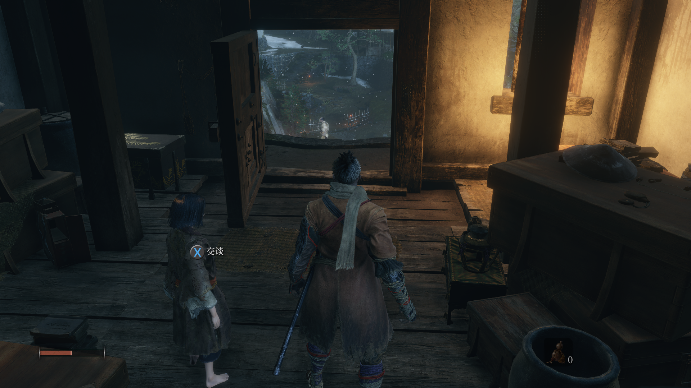

# 一. 梦开始的地方

## 1. 卿子小屋

​	

> + git命令

```bash
git add *
git commit -m "first-commit:qingzi's home" *
git remote  add zhlangArchive  git@github.com:cat2021-px/zhilang_archive.git
git push zhlangArchive master
```

## 2. 大将

