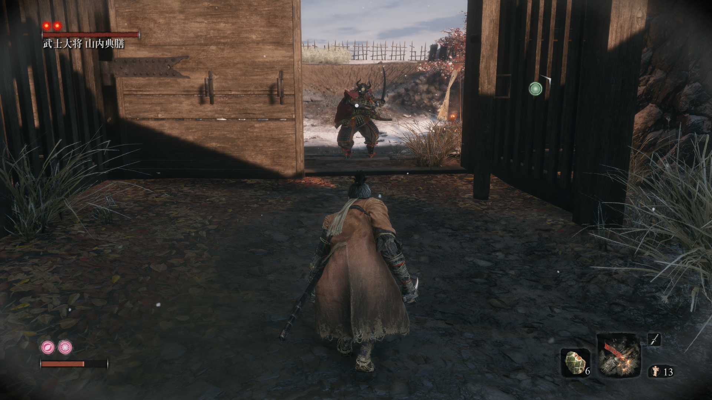

# 一. 梦开始的地方

## 1. 卿子小屋

​	

> + git命令

```bash
git add *
git commit -m "first-commit:qingzi's home" *
git remote  add zhlangArchive  git@github.com:cat2021-px/zhilang_archive.git
git push zhlangArchive master
```

## 2. 大将


```bash
$ git reflog
# a19f15e 大将的版本id
a19f15e (HEAD -> master, zhilangArchive/master) HEAD@{0}: commit: second-commit:dajiang
63148a5 HEAD@{1}: commit (initial): first-commit:qingzi's home

```


## 3. 长枪


```bash
$ git reflog
7927db9 (HEAD -> master, zhilangArchive/master) HEAD@{0}: reset: moving to 7927db9
a19f15e HEAD@{1}: reset: moving to a19f15e
# 长枪id 7927db9
7927db9 (HEAD -> master, zhilangArchive/master) HEAD@{2}: commit: third-commit:changqiang
a19f15e HEAD@{3}: commit: second-commit:dajiang
63148a5 HEAD@{4}: commit (initial): first-commit:qingzi's home

```


## 4. 八重塔忍者


```bash
$ git reflog
# 八重他忍者id b3374b2
b3374b2 (HEAD -> master, zhilangArchive/master) HEAD@{0}: commit: fourth-commit:bachongtarenzhe
7927db9 HEAD@{1}: reset: moving to 7927db9
a19f15e HEAD@{2}: reset: moving to a19f15e
7927db9 HEAD@{3}: commit: third-commit:changqiang
a19f15e HEAD@{4}: commit: second-commit:dajiang
63148a5 HEAD@{5}: commit (initial): first-commit:qingzi's home
```

## 5. 燃烧房子过桥相扑选手


```bash
# fifth-commit:huoFangZiXiangPu 225db52
225db52 (HEAD -> master, zhilangArchive/master) HEAD@{0}: commit: fifth-commit:huoFangZiXiangPu
b3374b2 HEAD@{1}: commit: fourth-commit:bachongtarenzhe
7927db9 HEAD@{2}: reset: moving to 7927db9
a19f15e HEAD@{3}: reset: moving to a19f15e
7927db9 HEAD@{4}: commit: third-commit:changqiang
a19f15e HEAD@{5}: commit: second-commit:dajiang
63148a5 HEAD@{6}: commit (initial): first-commit:qingzi's home

```

## 6. 虎口阶梯-赤鬼


```bash
# 赤鬼id 2e475e9
2e475e9 (HEAD -> master, zhilangArchive/master) HEAD@{0}: commit: sixth-commit:chigui
225db52 HEAD@{1}: commit: fifth-commit:huoFangZiXiangPu
b3374b2 HEAD@{2}: commit: fourth-commit:bachongtarenzhe
7927db9 HEAD@{3}: reset: moving to 7927db9
a19f15e HEAD@{4}: reset: moving to a19f15e
7927db9 HEAD@{5}: commit: third-commit:changqiang
a19f15e HEAD@{6}: commit: second-commit:dajiang
63148a5 HEAD@{7}: commit (initial): first-commit:qingzi's home
```

## 7. 赤鬼之后

